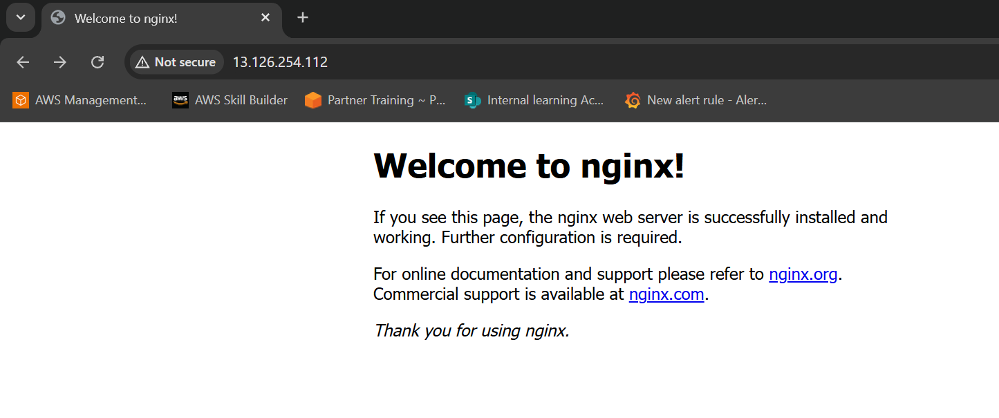
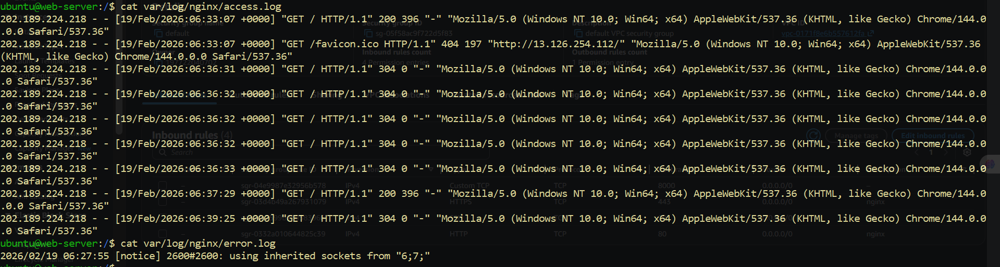

## Cloud Server Setup: Nginx & Web Deployment

Launch a cloud instance (AWS EC2 or Utho)
Connect via SSH
Install Nginx
Configure security groups for web access (port 80 by default for nginx)
Extract and save logs to a file
Verify your webpage is accessible from the internet

<!-- nginx  -->

=============================================

nginx access and error log snap

