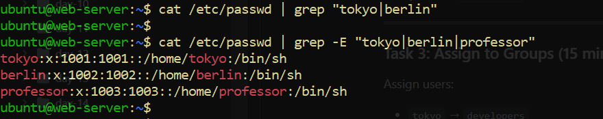
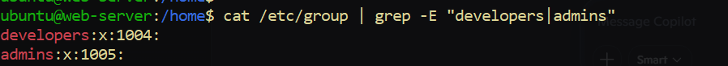
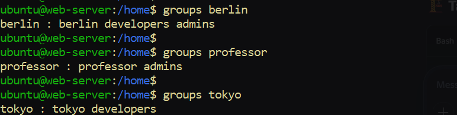
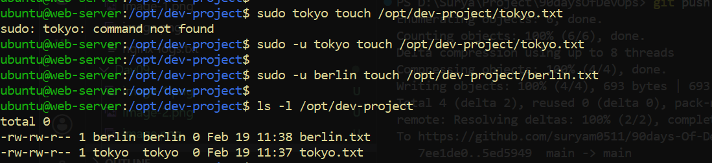

## Linux User & Group Management Challenge

Task 1: Create Users (20 minutes)
Create three users with home directories and passwords:

tokyo
berlin
professor
Verify: Check /etc/passwd and /home/ directory

===================================

sudo groupadd developers
sudo groupadd admins

# Verify
cat /etc/group | grep -E "developers|admins"

===================================

Task 3: Assign to Groups (15 minutes)
Assign users:

tokyo → developers
berlin → developers + admins (both groups)
professor → admins
Verify: Use appropriate command to check group membership

sudo usermod -aG developers berlin 

sudo usermod -aG admins berlin

===================================

# Create directory
sudo mkdir /opt/dev-project

# Set group owner
sudo chgrp developers /opt/dev-project

# Set permissions
sudo chmod 775 /opt/dev-project

# Test file creation
sudo -u tokyo touch /opt/dev-project/tokyo.txt
sudo -u berlin touch /opt/dev-project/berlin.txt

# Verify
ls -l /opt/dev-project

====================================

# Create user nairobi
sudo useradd -m nairobi
sudo passwd nairobi

# Create group project-team
sudo groupadd project-team

# Add nairobi and tokyo to project-team
sudo usermod -aG project-team nairobi
sudo usermod -aG project-team tokyo

# Create directory
sudo mkdir /opt/team-workspace

# Set group and permissions
sudo chgrp project-team /opt/team-workspace
sudo chmod 775 /opt/team-workspace

# Test file creation
sudo -u nairobi touch /opt/team-workspace/nairobi.txt

# Verify
ls -l /opt/team-workspace

