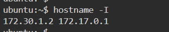
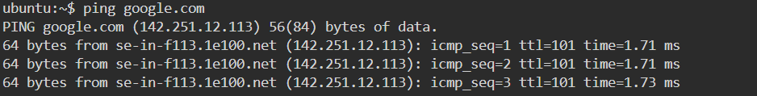
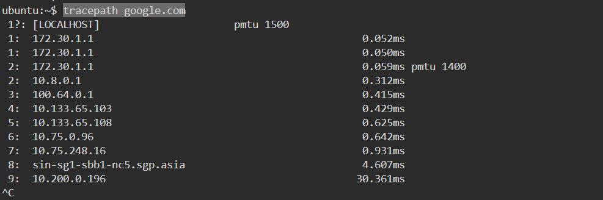
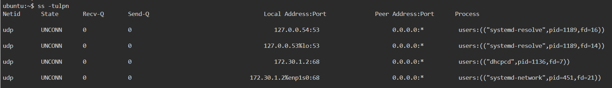
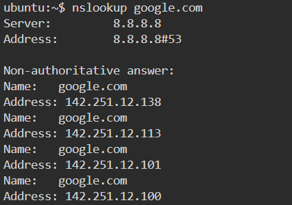
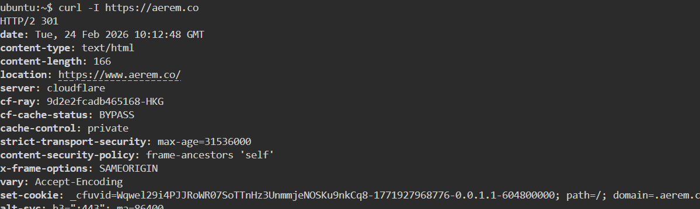
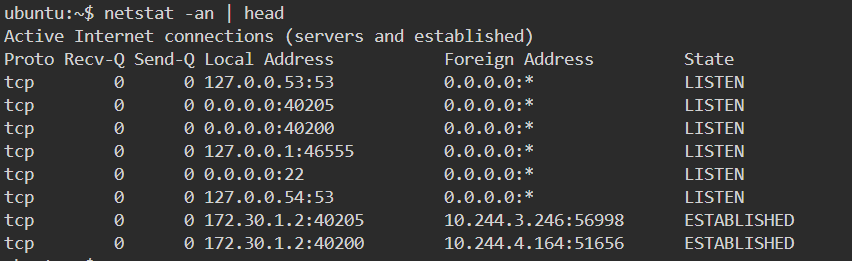
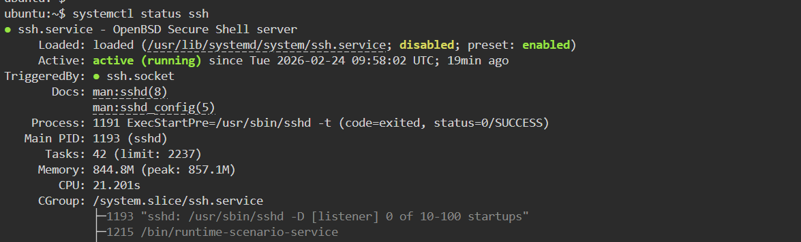
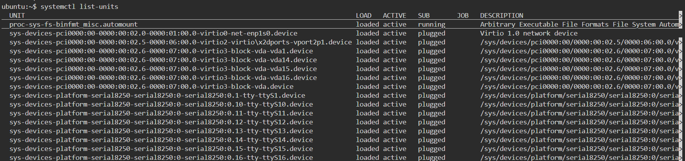

## Networking Fundamentals & Hands-on Checks

<!-- hostname -I -->

<!-- ip addr show -->

<!-- ping google.com -->

<!-- traceroute google.com -->

<!-- tracepath google.com -->

ss -tulpn

nslookup.google.com

curl -I https://example.com

netstat -an | head

systemctl status ssh

systemctl list-units

