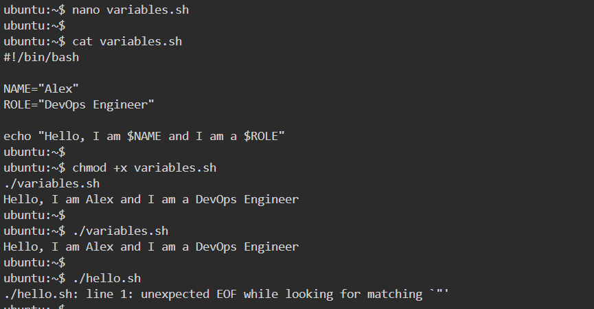
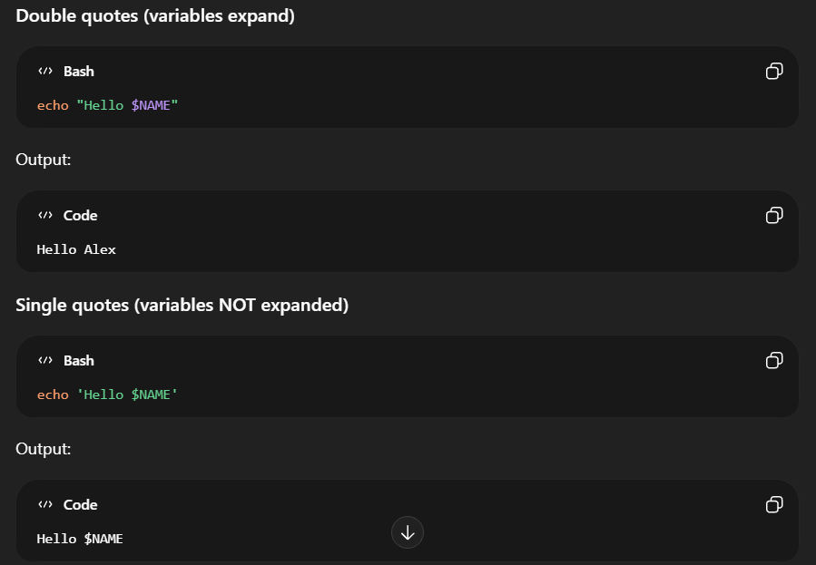
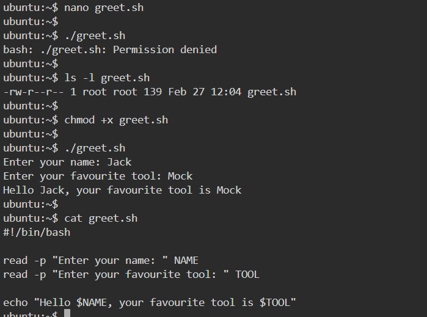
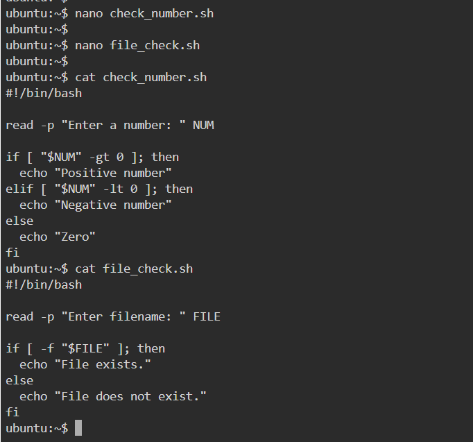

## Shell Scripting Basics

❓ Single quotes vs Double quotes

## Task 3: User Input with read

## Task 4: If-Else Conditions

## Task 5: Combine It All

🧠 Important Concepts You Just Learned

✔ Shebang & execution
✔ Variables & quoting
✔ User input
✔ Conditional logic
✔ File checks
✔ Service monitoring
✔ Bash syntax & structure

🎯 Interview Questions From These Tasks
❓ Why use shebang?

→ Defines interpreter.

❓ Difference between $VAR and "${VAR}"?

→ Curly braces prevent ambiguity.

❓ Why quote variables?

→ Prevent errors with spaces.

❓ What does -f do?

→ Checks if file exists.

❓ Difference between = and == in bash?

→ Both work in [ ], but = is POSIX standard.